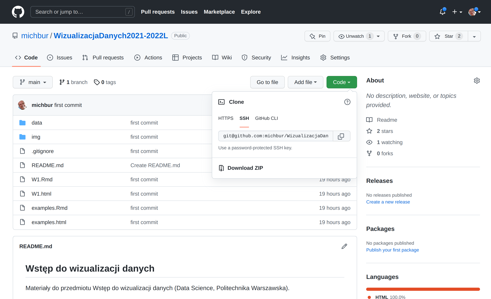
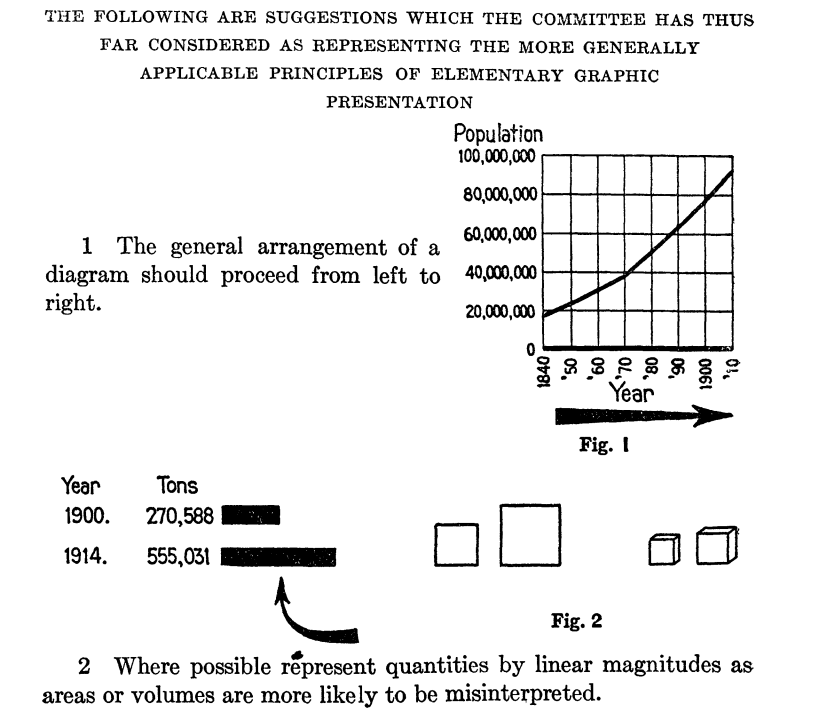

<link href="https://fonts.googleapis.com/css?family=Montserrat&display=swap" rel="stylesheet">

<style>
slides > slide {
  font-family: 'Montserrat', sans-serif;
}

.center {
  display: block;
  margin-left: auto;
  margin-right: auto;

}


</style>


```{r setup, include=FALSE}
library(knitr)
library(rgl)
library(ggplot2)
library(plotly)
library(dplyr)
library(patchwork)
library(ggthemes)
opts_chunk$set(echo = FALSE, message = FALSE, warning = FALSE)
knit_hooks$set(webgl = hook_webgl)
data("midwest", package = "ggplot2")
options(scipen=999)  # turn-off scientific notation like 1e+48
theme_set(theme_bw())  # pre-set the bw theme.
```

## O mnie

Michał Burdukiewicz:

 - bioinformatyk (UAB, UMB, IBB PAN, NIZP-PZH, BTU Cottbus-Senftenberg),
 - 14 lat doświadczenia z R,
 - Stowarzyszenie Wrocławskich Użytkowników R (stwur.pl),
 - Fundacja Why R? (whyr.pl).

Materiały: https://github.com/michbur/WizualizacjaDanych2021-2022L

Riseup: https://pad.riseup.net/p/WWD-tmp

Mail: michalburdukiewicz@gmail.com

## Materiały




## Literatura

 - Wilkinson, L. (2005). The Grammar of Graphics (New York: Springer-Verlag).
 - Biecek, P. (2016). Zbiór esejów o sztuce prezentowania danych Odkrywać! Ujawniać! Objaśniać!” (Warszawa: Wydawnictwo Uniwersytetu Warszawskiego).
 - Cairo, A. (2019). How Charts Lie: Getting Smarter about Visual Information
 - [Engebretsen M, Kennedy H. (2020). Data Visualization in Society](https://www.aup.nl/en/book/9789048543137/data-visualization-in-society)
 
## Plan spotkań

1. Czym są wizualizacje danych?
2. Gramatyka grafiki.
3. Błędy w wizualizacjach danych.
4. Narzędzia do wizualizacji danych.
5. Efektywne projektowanie dashboardów.
6. Zaaawansowane wizualizacje danych.

## Plan spotkań

1. **Czym są wizualizacje danych?**
2. **Gramatyka grafiki.**
3. **Błędy w wizualizacjach danych.**
4. **Narzędzia do wizualizacji danych.**
5. Efektywne projektowanie dashboardów.
6. Zaaawansowane wizualizacje danych.

# Historia wizualizacji danych

## Florence Nightingale


## Standardy



Joint Committee on Standards for Graphic Presentation (1915). **Standards for Graphic Presentation**. Publications of the American Statistical Association 14, 790–797.

## Czym są wizualizacje danych?

> **...(a) is based on qualitative or quantitative data and (b) results in an image that is representative of the raw data, which is (c) readable by viewers and supports exploration, examination, and communication of the data...**

$~$

Źródło: Tarek Azzam, Stephanie Evergreen, Amy A. Germuth, and Susan J. Kistler.
Data visualization and evaluation. New Directions for Evaluation, 2013(139):7 
32, 2013.

## Czym są wizualizacje danych?

> **...involves presenting data in graphical or pictorial form which makes the information easy to understand...**

$~$

Źródło: Matthew Sadiku, Adebowale Shadare, Sarhan Musa, Cajetan Akujuobi, and Roy
Perry. Data visualization. International Journal of Engineering Research and
Advanced Technology (IJERAT), 12:2454 6135, 12 2016.

## Czym są wizualizacje danych?

Wizualizacja danych to forma komunikacji. Tak jak każdy komunikat, wykresy muszą być przede wszystkim zrozumiałe dla odbiorcy.

## Rodzaje wizualizacji
```{r, echo=FALSE,warning=FALSE}
ggplot(cbind(expand.grid(x = c("Statyczne\n", "Interaktywne\n"),
                         y = c("Pojedyncza wizualizacja", "Wiele wizualizacji")), 
             software = c("Wykres", "Interaktywny\nwykres", "Infografika", "Dashboard")),
       aes(x = x, y = y, label = software)) +
  geom_tile(fill = NA, color = "black") +
  geom_text()  +
  theme_void() +
  theme(axis.text = element_text(color = "black"))
```

## Wizualizacja statyczna

```{r, echo=FALSE,warning=FALSE}

# midwest <- read.csv("http://goo.gl/G1K41K")  # bkup data source

# Scatterplot
gg <- ggplot(midwest, aes(x=area, y=poptotal)) + 
  geom_point(aes(col=state)) + 
  geom_smooth(method="loess", se=F) + 
  xlim(c(0, 0.1)) + 
  ylim(c(0, 500000)) + 
  scale_color_discrete("") +
  labs(y="Population", 
       x="Area") +
  theme_bw()

gg
```

## 3D


Wykresy 3D w **R**: https://github.com/tylermorganwall/rayshader

## Infografiki

Inspiracje: [VennGage](https://venngage.com/)


## Wizualizacje interaktywne

```{r, echo=FALSE,warning=FALSE}
ggplotly(gg)
```

## Dashboardy


# Gramatyka grafiki

## Gramatyka grafiki

Gramatyka grafiki (grammar of graphics): ustrukturyzowany opis wizualizacji danych.

Wilkinson, L. (2005). The Grammar of Graphics (New York: Springer-Verlag).

## Gramatyka grafiki


Źródło: https://blog.gtwang.org/

## Dane

```{r, echo=FALSE,warning=FALSE}
kable(head(iris))
```


## Atrybuty wizualne 

Atrybuty wizualne (aesthetics): mapowanie danych do osi, kolorów, kształtów.

```{r, echo=FALSE,warning=FALSE}
ggplot(iris, aes(x = Sepal.Length, y = Sepal.Width)) +
  geom_point(size = 4)
```

## Atrybuty wizualne 

```{r, echo=FALSE,warning=FALSE}
ggplot(iris, aes(x = Sepal.Length, y = Sepal.Width)) +
  geom_point(size = 4)
```

**Oś X:** Sepal.Length.
**Oś Y:** Sepal.Width.

## Atrybuty wizualne 

```{r, echo=FALSE,warning=FALSE}
ggplot(iris, aes(x = Sepal.Length, y = Sepal.Width, color = Species)) +
  geom_point(size = 4)
```

**Oś X:** Sepal.Length.
**Oś Y:** Sepal.Width.
**Kolor:** Species.

## Atrybuty wizualne 

```{r, echo=FALSE,warning=FALSE}
ggplot(iris, aes(x = Sepal.Length, y = Sepal.Width, shape = Species)) +
  geom_point(size = 4)
```

**Oś X:** Sepal.Length.
**Oś Y:** Sepal.Width.
**Kształt:** Species.

## Atrybuty wizualne 

```{r, echo=FALSE,warning=FALSE}
ggplot(iris, aes(x = Sepal.Length, y = Sepal.Width, color = Species, shape = Species)) +
  geom_point(size = 4)
```

**Oś X:** Sepal.Length.
**Oś Y:** Sepal.Width.
**Kształt:** Species.
**Kolor:** Species.

## Geometrie

```{r, echo=FALSE,warning=FALSE}
ggplot(iris, aes(x = Species, y = Sepal.Length)) +
  stat_summary(fun.y = "mean", geom = "point")
```

Geometrie: obiekty reprezentujące dane.

## Geometrie

```{r, echo=FALSE,warning=FALSE}
ggplot(iris, aes(x = Species, y = Sepal.Length)) +
  stat_summary(fun.y = "mean", geom = "bar")
```

## Fasety

```{r, echo=FALSE,warning=FALSE}
mutate(iris, 
       Petal.Length = cut(Petal.Length, 
                          breaks = c(min(Petal.Length), median(Petal.Length), max(Petal.Length)), 
                          include.lowest = TRUE)) %>% 
  ggplot(aes(x = Sepal.Length, y = Sepal.Width, color = Species, shape = Species)) +
  geom_point(size = 4) +
  facet_wrap(~ Petal.Length, labeller = label_both)
```

Dzielenie wykresu na podwykresy w zależności od poziomu zmiennej dyskretnej. 

## Fasety

```{r, echo=FALSE,warning=FALSE}
p1 <- ggplot(iris, aes(x = Sepal.Length)) +
  geom_density() +
  facet_wrap(~ Species)

p1
```

## Fasety

Wykres poprzedni bez fasetowania.

```{r, echo=FALSE,warning=FALSE}
p2 <- ggplot(iris, aes(x = Sepal.Length, fill = Species)) +
  geom_density(alpha = 0.7)

p2
```

## Fasety

```{r, echo=FALSE,warning=FALSE}
p1/p2
```

## Statystyki

```{r, echo=FALSE,warning=FALSE}
ggplot(iris, aes(x = Sepal.Length)) +
  geom_density() +
  facet_wrap(~ Species)
```

Transformacje danych w celu przypisania ich do atrybutów wizualnych.

## Statystyki

```{r, echo=FALSE,warning=FALSE}
ggplot(iris, aes(x = Species, y = Sepal.Length)) +
  geom_boxplot()
```


## Statystyki

```{r, echo=FALSE,warning=FALSE}
ggplot(iris, aes(x = Species, y = Sepal.Length)) +
  geom_violin()
```

## Statystyki

```{r, echo=FALSE,warning=FALSE}
ggplot(iris, aes(x = Species, y = Sepal.Length)) +
  geom_violin() +
  geom_boxplot()
```

## Statystyki

```{r, echo=FALSE,warning=FALSE}
library(ggbeeswarm)
ggplot(iris, aes(x = Species, y = Sepal.Length)) +
  geom_quasirandom(method = "smiley")
```


## Statystyki

```{r, echo=FALSE,warning=FALSE}
ggplot(iris, aes(x = Sepal.Length, y = Sepal.Width, color = Species, shape = Species)) +
  geom_point(size = 4)
```

## Statystyki

```{r, echo=FALSE,warning=FALSE}
ggplot(iris, aes(x = Sepal.Length, y = Sepal.Width, fill = Species)) +
  stat_density2d(aes(alpha = ..level..), geom = "polygon", color = "black")
```

## Koordynaty

```{r, echo=FALSE,warning=FALSE}
ggplot(iris, aes(x = Species)) +
  geom_bar()
```

## Koordynaty

```{r, echo=FALSE,warning=FALSE}
ggplot(iris, aes(x = 1, fill = Species)) +
  geom_bar() +
  coord_polar("y", start = 0)
```

## Motyw

```{r, echo=FALSE,warning=FALSE}
ggplot(iris, aes(x = Sepal.Length, y = Sepal.Width, color = Species, shape = Species)) +
  geom_point(size = 4) 
```

## Motyw

```{r, echo=FALSE,warning=FALSE}
ggplot(iris, aes(x = Sepal.Length, y = Sepal.Width, color = Species, shape = Species)) +
  geom_point(size = 4) +
  theme_economist() +
  ggtitle("Theme: economist")
```

## Motyw

```{r, echo=FALSE,warning=FALSE}
ggplot(iris, aes(x = Sepal.Length, y = Sepal.Width, color = Species, shape = Species)) +
  geom_point(size = 4) +
  theme_tufte() +
  ggtitle("Theme: Tufte")
```

## Motyw

```{r, echo=FALSE,warning=FALSE}
ggplot(iris, aes(x = Sepal.Length, y = Sepal.Width, color = Species, shape = Species)) +
  geom_point(size = 4) +
  theme_excel() +
  ggtitle("Theme: Excel")
```

## Stylizowanie wizualizacji

1. Czcionki.
2. Dodatkowe elementy graficzne.

## Czcionki

1. Czcionka do tytułów/nagłówków.
2. Treść dokumentu.
3. Wyróżnianie treści.

## Czcionki

<a href="https://cdn.dribbble.com/users/18730/screenshots/1593976/attachments/246597/full_pixels.png"></a>

## Czcionki

Czcionki wykorzystywane przez Tableau są tak dobrane, aby zapewnić maksymalną czytelność przy małych rozmiarach. 

<a href="https://help.tableau.com/current/pro/desktop/en-us/Img/format_font_best_practices.png"></a>

## Grafiki

Elementy graficzne nawiązujące do treści wzmacniają przekaz i pozwalają lepiej zrozumieć dane.

## Grafiki

<a href="http://s3.amazonaws.com/wp_media-prod/app/uploads/2015/09/24112845/Infographic_Design_Example_Captora.jpg"></a>

## Gramatyka grafiki

| Nazwa                          | Przykłady                                              |
|--------------------------------|--------------------------------------------------------|
| Dane (data)                    |                                                        |
| Atrybuty wizualne (aesthetics) | Osie, kolory, kształty, typy linii                     |
| Geometrie (geometries)         | Linie, słupki, punkty                                  |
| Fasety (facets)                | Podrysunki tworzone na podstawie dyskretnych zmiennych |
| Statystyki (statistics)        | Średnie, mediany, kwantyle.                            |
| Koordynaty (coordinates)       | Kartezjański, polarny                                  |
| Motyw (theme)                  | Wygląd rysunku                                         |


## Przykłady

```{r}
dat <- read.csv("./data/polish-driver-license.csv")
kable(dat[1L:2, ])
```

 - **voivodeship**: województwo
 - **sex**: płeć
 - **age**: wiek
 - **count**: liczba uzyskanych praw jazdy
 - **year**: rok
 - **month**: miesiąc
 
Riseup: https://pad.riseup.net/p/WWD-tmp

# Błędy w wizualizacjach 

## Rodzaje złych wizualizacji

1. Fałszywe (przedstawiające fałszywe informacje)
2. Mylące (przedstawiające fałszywie rzeczywiste informacje).

## Wizualizacje i prawda


How to Lie with Statistics, Darrell Huff

## Korelacje i współwystępowanie


## Złe wizualizacje


Trudne porównania - niewłaściwie wybrana metoda wizualizacja.

## Złe wizualizacje


Niewłaściwie wybrana metoda wizualizacji.

## Złe wizualizacje


Zbyt duża ilość informacji na jednym wykresie.

## Trzeci wymiar


## Wykresy kołowe


## Wykresy kołowe


## Ucięte osie


## Ucięte osie


## Kolory

<a href="https://venngage-wordpress.s3.amazonaws.com/uploads/2016/08/true-colors.png"></a>

## Kolory

Kolory mogą nawiązywać do treści wizualizacji...

<a href="https://venngage-wordpress.s3.amazonaws.com/uploads/2015/10/6fb75103-db4f-4cb5-ab51-d61be9ea7b2d-1.png"></a>

## Kolory

... ale schemat kolorystyczny powinien być stosowany konsekwentnie.

<a href="https://technofaq.org/wp-content/uploads/2015/04/Uber-Vs-Hailo-The-Battle-of-the-Taxi-Apps.jpg"></a>

## Kolory 

<a href="http://www.asawicki.info/files/Rules%20to%20Make%20Image%20Looking%20Good%20on%20Projector%201.jpg"></a>

Źródło: http://www.asawicki.info/

## Kolory 

<a href="http://www.asawicki.info/files/Rules%20to%20Make%20Image%20Looking%20Good%20on%20Projector%202.jpg"></a>

Źródło: http://www.asawicki.info/

## Kolory

<a href="http://www.asawicki.info/files/Rules%20to%20Make%20Image%20Looking%20Good%20on%20Projector%203.jpg"></a>

Źródło: http://www.asawicki.info/

## Widzenie barwne

https://www.color-blindness.com/coblis-color-blindness-simulator/

## Kolory

Tableau domyślnie dobiera palety kolorów (zarówno ilościowe jak i kategoryczne), które są łatwo rozróżnialne również dla osób z zaburzeniami widzenia barwnego.

## Kolory

https://colorbrewer2.org/: narzędzie do generowania palet kolorów.

## Prostota

Nadmiar stylizacji wykresu może zmniejszać czytelność wykresu.

## Prostota

<a href="https://www.visualcapitalist.com/wp-content/uploads/2020/03/DeadliestPandemics-Infographic-87.jpg"></a>

## Ocena wizualizacji danych

Riseup: https://pad.riseup.net/p/WWD-tmp

# Narzędzia do wizualizacji

## Narzędzia

1. Programistyczne (R, Python, JavaScript)
2. Programy graficzne (Inkscape).
3. Programy dedykowane do wizualizacji danych (Tableau).

## Języki wizualizacji danych

```{r}
ggplot(cbind(expand.grid(x = c("Imperatywne\n", "Deklaratywne\n"),
                         y = c("Proste do użycia", "Wszechstronne")), 
             software = c("Seaborn", "Bokeh\nR (ggplot2)\nLeaflet\nVega-Lite",  "Matplotlib\nR (base, grid)", "BQPlot\nD3\nPlotly\nVega")),
       aes(x = x, y = y, label = software)) +
  geom_tile(fill = NA, color = "black") +
  geom_text()  +
  theme_void() +
  theme(axis.text = element_text(color = "black"))
```

## Podział narzędzi do wizualizacji danych

Deklaratywne:

 - zadanie: warunki jakie musi spełniać wizualizacja,
 - jak wizualizacja jest wykonywana jest rozstrzygane wewnętrznie i niezależnie od użytkownika,
 - oddzielenie specyfikacji od wykonania.

Imperatywne:

 - zadanie: krok po kroku jak stworzyć wizualizację,
 - użytkownik w pełni kontroluje każdy detal wizualizacji,
 - jeśli warunki jakie musi spełniać wizualizacja zmienią się nawet odrobinę, instrukcja tworzenia może się zmienić znacząco.

## Języki wizualizacji danych

```{r}
ggplot(cbind(expand.grid(x = c("Imperatywne\n", "Deklaratywne\n"),
                         y = c("Proste do użycia", "Wszechstronne")), 
             software = c("Seaborn", "Bokeh\nR (ggplot2)\nLeaflet\nVega-Lite",  "Matplotlib\nR (base, grid)", "BQPlot\nD3\nPlotly\nVega")),
       aes(x = x, y = y, label = software)) +
  geom_tile(fill = NA, color = "black") +
  geom_text()  +
  theme_void() +
  theme(axis.text = element_text(color = "black")) +
  ggtitle("Jakich narzędzi używamy w codziennej praktyce?")
```

## Altair (Python)

https://altair-viz.github.io/gallery/simple_bar_chart.html

https://altair-viz.github.io/gallery/scatter_tooltips.html

https://altair-viz.github.io/gallery/line_with_ci.html

## Altair (Python)

Pythonowe API dla Vega-Lite.

Brian Granger, uzasadniając stworzenie Altaira: *I love Python, but do my visualisations using R/ggplot2*.

## Altair (Python)

- Małe wsparcie dla typowo stastycznych wizualizacji

Pakiet R: https://github.com/vegawidget/altair (używa reticulate).

## bokeh (Python)

https://demo.bokeh.org/movies

## bokeh (Python)

- Python jako API do BokehJS,
- praca głownie w Pythonie, JSowy silnik mało dostępny i źle udokumentowany,
- całe dashboardy.

## bokeh (R)

- implementacja w R: https://github.com/bokeh/rbokeh
- ostatni commit: 26.04.2017

## Leaflet 

[Leaflet.js](https://leafletjs.com/): interaktywne mapy.

## Leaflet

W R: https://rstudio.github.io/leaflet/

W Pythonie: https://github.com/python-visualization/folium

## matplotlib (Python)

https://matplotlib.org/

## matplotlib (Python)

- trudne zarządzanie czasem na osiach,
- niesatysfakcjonujące mapowanie do kształtów.

Rozszerzenia: https://mpld3.github.io/

## plot.ly

```{r, echo=FALSE,warning=FALSE}
plotly::ggplotly(gg)
```

## seaborn

https://seaborn.pydata.org/ - oparte na matplotlib.

Świetne szablony wizualizacji!

## Vega-Lite

Pakiety w R: https://github.com/hrbrmstr/vegalite i https://github.com/vegawidget/vegawidget

## Vega

JSONowa specyfikacja wizualizacji.

Lyra (nie zniechęcać się http://vega.github.io/lyra/).

Lyra 1.0 jest online i działa satysfakcjonująco: http://idl.cs.washington.edu/projects/lyra/.

## Programy graficzne 

Inkscape: darmowy i otwarty edytor grafiki wektorowej.

 - [Oficjalny tutorial](https://inkscape.org/en/doc/basic/tutorial-basic.pl.html).
 - [Inkscape w praktyce](https://pl.wikibooks.org/wiki/Inkscape_w_praktyce).


