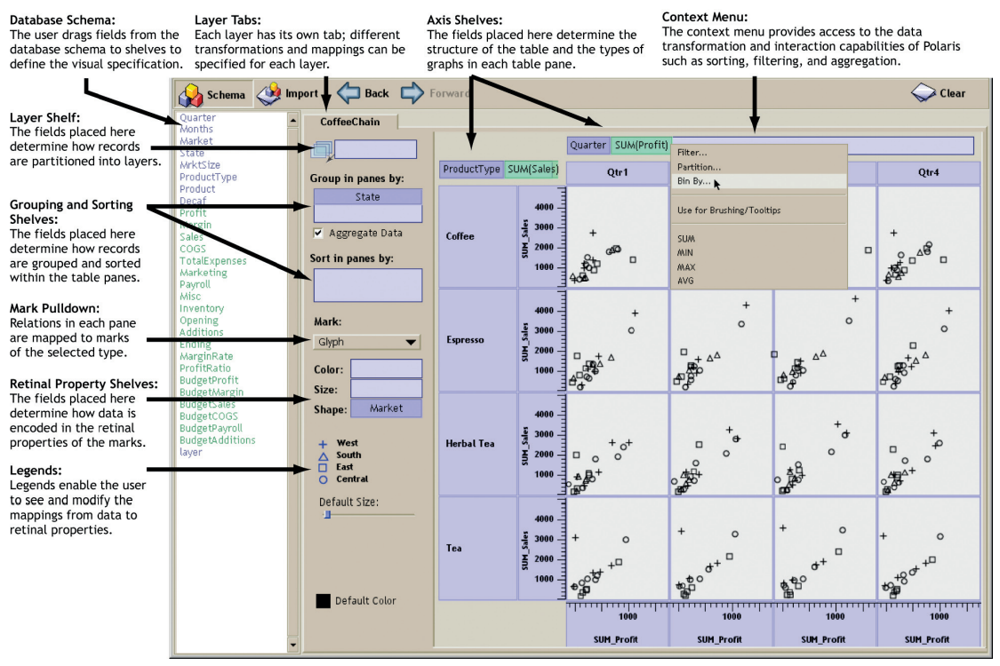

<link href="https://fonts.googleapis.com/css?family=Montserrat&display=swap" rel="stylesheet">

<style>
slides > slide {
  font-family: 'Montserrat', sans-serif;
}

.center {
  display: block;
  margin-left: auto;
  margin-right: auto;

}


</style>


```{r setup, include=FALSE}
library(knitr)
library(rgl)
library(ggplot2)
library(plotly)
library(dplyr)
library(patchwork)
library(ggthemes)
library(ggbeeswarm)
opts_chunk$set(echo = FALSE, message = FALSE, warning = FALSE)
theme_set(theme_bw())  # pre-set the bw theme.
```

## Przypomnienie

Materiały: https://github.com/michbur/WizualizacjaDanych2021-2022L

Riseup: https://pad.riseup.net/p/WWD-tmp

Mail: michalburdukiewicz@gmail.com

## Plan spotkań

1. Czym są wizualizacje danych?
2. Gramatyka grafiki.
3. Błędy w wizualizacjach danych.
4. Narzędzia do wizualizacji danych.
5. **Efektywne projektowanie dashboardów.**
6. **Zaaawansowane wizualizacje danych.**

# Polaris

## Twórcy

"Polaris, an interface for exploring large multi-dimensional databases that extends the well-known Pivot Table interface first popularized by Microsoft Excel."

http://www.graphics.stanford.edu/projects/polaris/

Źródło: *Polaris: a system for query, analysis, and visualization of multidimensional databases*, Proceeding IEEE InfoVis’00 reprinted Commun. ACM 51, 11 (November 2008), 75-84.

Twórcy:

 - Chris Stolte,
 - Diane Tang,
 - Pat Hanrahan.

## Założenie

1. Interfejs do eksploracji danych.
2. Zróżnicowane metody wizualizacji danych.
3. Wizualizacje o wysokiej wymiarowości i gęstości informacji. 

## Tabelaryczne ujęcie danych



## Tabelaryczne ujęcie danych

Zalety:

 - wielowymiarowość,
 - swojskość,
 - łatwość porównań (tabele generują wiele małych przedstawień informacji, które łatwo ze sobą porównywać w celu wskazania trendów/korelacji pomiędzy wymiarami).
 
## Tabelaryczne ujęcie danych


# Efektywne projektowanie dashboardów

## Rodzaje dashboardów

 - analityczne,
 - operacyjne.


Źródło: https://uxplanet.org/

## Analityczny dashboard


Źródło: https://uxplanet.org/


## Operacyjny dashboard


Źródło: https://uxplanet.org/

## Układ treści


Źródło: https://www.sisense.com/blog/4-design-principles-creating-better-dashboards/

## Właściwy dobór wizualizacji do danych

<a href="https://www.tapclicks.com/wp-content/uploads/Charts-and-Graphs-Guide-1024x768-1.jpg"></a>

Źródło: https://www.tapclicks.com/resources/blog/the-ultimate-guide-to-data-visualization/.

## Interakcja

"*Only 10–15% of people click on buttons*".

Gregor Aisch, New York Times, podczas Information+ Conference, 2016.

## Interakcja

"*15% of readers isn’t nobody*".

Gregor Aisch, New York Times, 2017.

## Zastosowanie interakcji

Kluczowa informacja na wykresie nie może być skryta przed użytkownikiem za pomocą interakcji.

Interakcje powinny zawierać wyłącznie informacje doprecyzowujące główny przekaz.


## Interaktywność

Zbędna interaktywność wymaga od nas akcji w celu uzyskania podstawowych informacji.


Źródło: [Data + design](https://trinachi.github.io/data-design-builds/titlepage01.html)

## Interaktywność

Poprawnie użyta interaktywność ułatwia eksplorację danych.


Źródło: [Data + design](https://trinachi.github.io/data-design-builds/titlepage01.html)

## Przykład: tooltipy

```{r}
ggplotly(ggplot(iris, aes(x = Sepal.Length, y = Petal.Length, group = Species)) +
           geom_point() +
           theme_bw()) 
```

Cel wizualizacji: zależność długości pręcika od długości słupka w podziale na gatunki irysów.

## Przykład: tooltipy

```{r}
ggplotly(ggplot(iris, aes(x = Sepal.Length, y = Petal.Length, color = Species)) +
           geom_point() +
           theme_bw()) 
```

Cel wizualizacji: zależność długości pręcika od długości słupka w podziale na gatunki irysów.

## Przykład: tooltipy

```{r}
ggplotly(ggplot(iris, aes(x = Sepal.Length, y = Petal.Length, shape = Species)) +
           geom_point() +
           theme_bw()) 
```

Cel wizualizacji: zależność długości pręcika od długości słupka w podziale na gatunki irysów.

## Przykład: tooltipy

```{r}
ggplotly(ggplot(iris, aes(x = Sepal.Length, y = Petal.Length, group = Species)) +
           geom_point() +
           theme_bw()) 
```

Cel wizualizacji: zależność długości pręcika od długości słupka <s>w podziale na gatunki irysów</s>.

## Przykład: zbliżenie

```{r}
ggplotly(ggplot(iris, aes(x = Sepal.Length, y = Petal.Length, color = Species)) +
           geom_point() +
           coord_cartesian(xlim = c(7, 8), ylim = c(4, 7)) +
           theme_bw()) 
```

Cel wizualizacji: zależność długości pręcika od długości słupka w podziale na gatunki irysów.

## Przykład: zbliżenie

```{r}
ggplotly(ggplot(iris, aes(x = Sepal.Length, y = Petal.Length, color = Species)) +
           geom_point() +
           geom_rect(xmin = 7, xmax = 8, ymin = 4, ymax = 7, color = "black", fill = NA,
                     linetype = "dashed") +
           theme_bw()) 
```

Cel wizualizacji: zależność długości pręcika od długości słupka w podziale na gatunki irysów.


# Zaawansowane wizualizacje danych

## Wybór wykresu

 - https://www.data-to-viz.com/

 - https://datavizcatalogue.com/

## Mapa drzewa

<a href="https://support.content.office.net/en-us/media/b3bfff05-380e-4dd9-b49b-7a2bfd128870.png"></a>


Źródło: MS Office.

## Mapa drzewa

Mapa drzewa (treemap): wizualizacja hierarchicznych danych za pomocą zagnieźdżonych obiektów.

## Wykresy radarowe

<a href="https://www.edrawsoft.com/chart/images/spider-chart-example-class.png"></a>

Źródło: edrawsoft.com

## Wykresy radarowe

Wykres radarowy (radar plot): porównanie kilku obiektów pod względem wielu charakterystyk.

## Wykres trójkątny

<a href="https://i.stack.imgur.com/r7fYI.png"></a>

## Wykres trójkątny


Źródło: https://fivethirtyeight.com/features/the-worst-tweeter-in-politics-isnt-trump/

## Wykres trójkątny

Wykres trójkątny (ternary plot): przedstawienie w dwóch wymiarach trzech zmiennych ciągłych.

## Diagram Sankeya

<a href="https://i.stack.imgur.com/zME0a.png"></a>

## Diagram Sankeya

```{r}
library(ggalluvial)

ggplot(as.data.frame(Titanic),
       aes(y = Freq,
           axis1 = Survived, axis2 = Sex, axis3 = Class)) +
  geom_alluvium(aes(fill = Class),
                width = 0, knot.pos = 0, reverse = FALSE) +
  guides(fill = FALSE) +
  geom_stratum(width = 1/8, reverse = FALSE) +
  geom_text(stat = "stratum", infer.label = TRUE, reverse = FALSE) +
  scale_x_continuous(breaks = 1:3, labels = c("Survived", "Sex", "Class")) +
  ggtitle("Titanic survival by class and sex") 
  
```

## Diagram Sankeya

Diagram Sankeya (alluvial plot): przestawienie przepływu obiektów między poszczególnymi stanami.

## Wykres strunowy

<a href="https://www.data-to-viz.com/graph/chord_files/figure-html/unnamed-chunk-1-1.png"></a>

Źródło: https://www.data-to-viz.com/

## Wykres strunowe

```{r}
library(circlize)
set.seed(999)
mat = matrix(sample(18, 18), 3, 6) 
rownames(mat) = paste0("S", 1:3)
colnames(mat) = paste0("E", 1:6)

df = data.frame(from = rep(rownames(mat), times = ncol(mat)),
    to = rep(colnames(mat), each = nrow(mat)),
    value = as.vector(mat),
    stringsAsFactors = FALSE)

chordDiagram(mat)
```

## Wykres strunowy

Wykres strunowy (chord diagram): przedstawienie zależności/przepływów między wieloma parami stanów.

# Podsumowanie

## Wizualizacje


Źródło: informationisbeautiful.net

## Dobitne wizualizacje

<iframe width="1166" height="656" src="https://www.youtube.com/embed/bRkXPuGAHkE" frameborder="0" allow="accelerometer; autoplay; encrypted-media; gyroscope; picture-in-picture" allowfullscreen></iframe>
